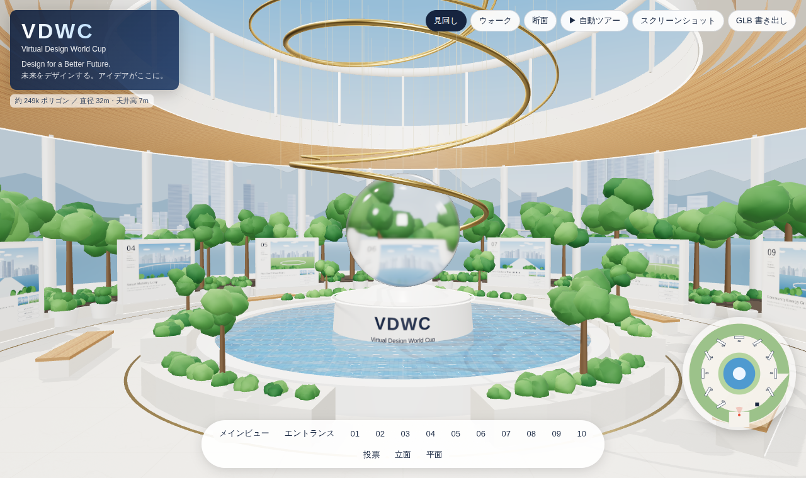

# 3D 空間ビューア集

- **VDWC Virtual Gallery**（このページ）: https://ima2daka2mi-sys.github.io/3D-model-generation/
- **ワンヘルス・クエスト（仮称）**: https://ima2daka2mi-sys.github.io/3D-model-generation/onehealth/ — 詳細は [onehealth/README.md](onehealth/README.md)

# VDWC Virtual Gallery — 3D ブラウザビューア

「Virtual Design World Cup」審査ギャラリー（仕様パネル左上のメインビジュアル）を three.js で 3D 化し、ブラウザで閲覧できるようにしたものです。



## 起動方法

ES Modules を使うため、ローカル HTTP サーバー経由で開いてください（`file://` 直開きは不可）。

```bash
python3 -m http.server 8000
# または: npx serve .
```

ブラウザで <http://localhost:8000> を開きます。three.js は `vendor/` に同梱しているので、ネット接続なしでも動きます。

## 操作

| 操作 | 内容 |
| --- | --- |
| 見回し | 左ドラッグ：回転／右ドラッグ：移動／ホイール：ズーム |
| ウォーク | 一人称ウォークスルー。WASD・矢印キーで移動、マウスで視点、Shift で速く、Esc で解除 |
| 断面 | 中央で切断した断面表示（立面図の再現） |
| 自動ツアー | エントランス → 01 → 02 … → 10 → 投票エリアの回遊動線を自動再生 |
| 下部ボタン | メインビュー／エントランス／各パネル 01–10／投票／立面／平面（平面では屋根を自動で非表示） |
| パネルをクリック | そのパネルの前に移動し、作品情報カードを表示 |
| スクリーンショット | 現在の視点を PNG 保存 |
| GLB 書き出し | シーン全体を `vdwc_gallery.glb`（glTF 2.0 バイナリ）として保存 |

## 仕様パネルとの対応

| 項目 | 仕様 | 実装 |
| --- | --- | --- |
| ホール直径 | 約 32m | 半径 16m の円形ホール、ガラスカーテンウォール＋列柱 |
| 中央水盤 | 直径 約 10m | 半径 5m の水盤（揺らぐ水面）＋台座＋ガラス地球儀＋金色スパイラル |
| 通路幅 | 約 4.5m | 水盤まわりのプランター外周からパネル面まで 4.5m |
| 展示パネル | 幅 3.0m・間隔 3.0m・高さ 2.4m、10 枚 | 30° ピッチで 01–10 を配置（番号・メイン画像・タイトル・チーム・国・概要・ボタン） |
| 天井高 | 約 7.0m | 木調ルーバー天井（同心円状） |
| 中央吹抜け | 約 10.0m | 天井開口の上にガラスのドラム（高さ 10m まで） |
| エントランス | 紺のサインウォール＋「Design for a Better Future.」 | 入口通路と両側のサイン、テキストモニュメント |
| 投票エリア | VOTE サイン＋端末 | 10 番の隣（入口の手前）に配置 |
| マテリアル | 石材（マット）・木調・ガラス・金属（シャンパンゴールド）・植栽・水面 | すべて PBR マテリアル（テクスチャはプログラム生成） |
| ポリゴン数 | 〜300,000 | 約 25 万ポリゴン（植栽はインスタンシング） |
| ファイル形式 | GLB (glTF 2.0) | 「GLB 書き出し」ボタンで出力（テクスチャ最大 2K） |

各パネルの作品名・チーム名・国はサンプル（仮）です。`src/data.js` の `ENTRIES` を書き換えると差し替えられます。

## ファイル構成

```
index.html        UI とインポートマップ
src/data.js       寸法（SPEC）・レイアウト半径・作品データ
src/hall.js       空間モデルの生成（床・水盤・地球儀・パネル・植栽・天井・入口・投票エリア）
src/textures.js   キャンバスで生成するテクスチャ（都市画像・パネル面・石・木・水・文字）
src/main.js       レンダラー、カメラ操作、ツアー、ミニマップ、GLB 書き出し
vendor/three/     three.js r186（MIT ライセンス）
```
